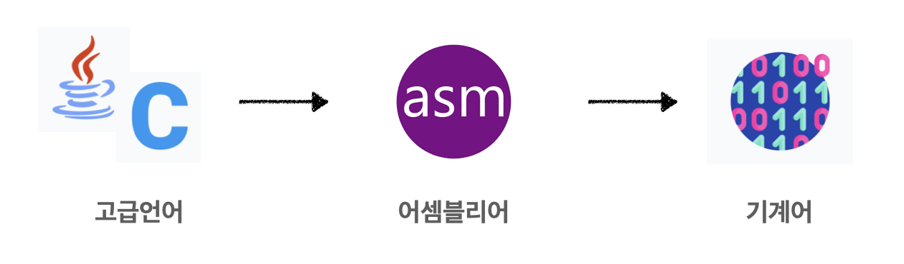
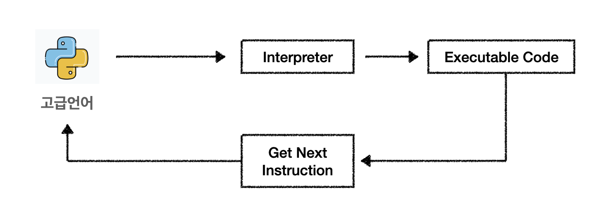

# 1. Introduce JavaScript

> 자바스크립트 완벽가이드를 읽고 작성한 개인 노트입니다. 조원들과 토론을 통해서 서로 배운 내용과 깨달은 내용에 대해서 논의한 부분 또한 함께 녹이려고 노력했습니다.
> 
1. **인터프리터 언어와 컴파일러 언어**
    - 인터프리터 및 컴파일러는 고급언어를 컴퓨터가 이해할 수 있도록 기계어로 변환하는데 도움을 주는 프로그램으로, **인터프리터와 컴파일러의 차이는 “어떻게" 기계어로 변환시켜주느냐**의 방식의 차이이다.
        - 컴파일러언어 프로세스
            
            
            
        - 인터프리터언어 프로세스
            
            
            
    - 인터프리터와 컴파일러의 차이점
   
    |  | 인터프리터 | 컴파일러 |
    | --- |----------------------------| --- |
    | 기계어 번역 방식 | 한 번에 하나의 명령문만 기계어로 번역 | 전체 프로그램을 스캔하고 한 번에 기계어로 번역 |
    | 소요 시간 | 코드 분석 시간: 빠름 프로세스 실행 시간: 느림 | 코드 분석 시간: 느림 프로세스 실행 시간: 빠름 |
    | 메모리 | 적은 메모리 사용 (중간 코드 생성 X) | 많은 메모리 사용 (중간 코드 생성 O) |
    | 디버깅 | 디버깅 쉬움 → 첫 오류 발견 시 중지 | 디버깅 어려움 → 스캔 후 오류 메시지 생성 |
    | 사용언어 | Ruby, Python | C++, C, Java |
    | 장점 | 소스 코드 작업 쉬움 | 코드 실행 시간: 빠름 |
    | 단점 | 해석기가 있는 컴퓨터에서만 실행 가능 | 소스 수정 불가능 |
    
2. **자바스크립트의 역사**
    1. 웹 초기에 넷스케이프(현 모질라)에서 만듦
    2. 표준화하기 위해 ECMA에 제출 → ECMAScript 라는 이름을 얻게됨
    3. ES6를 마지막으로 년도를 사용하기로 결정
    
3. **자바스크립트의 특징** 
    - 자바스크립트의 코어에는 최소한의 API만 정의되어 있다. → **입출력 관련 부분을 정의 되어 있지 않음**
    - 자바스크립트가 임베드된 **‘호스트 환경'**이 담당
        - 웹 브라우저: 사용자의 마우스와 키보드 입력을 받고, HTTP 요청을 보내도록 허용
        - 노드: 운영 체제 전체에 접근해 파일을 읽고 쓰고, 네트워크를 통해 데이터를 송수신하고, HTTP 요청을 보내고 받을 수 있게 만듦